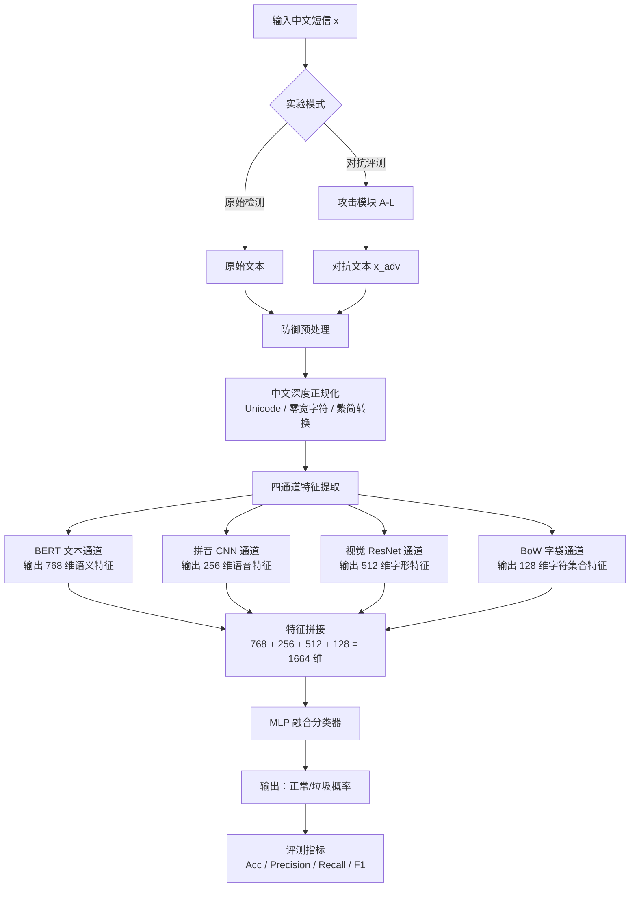
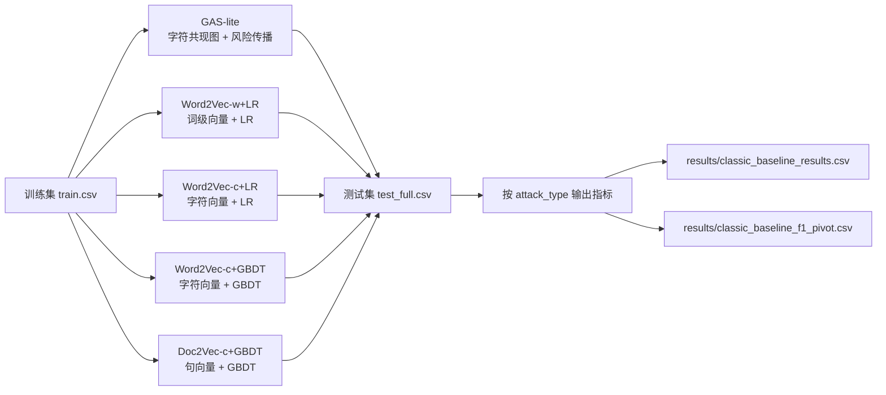

# 文本检测对抗攻防系统

> Text Defense: Adversarial Attack & Defense for Chinese Spam Detection  
> 大数据原理与技术 · 期末大作业

## 概述

本项目构建了一个完整的**中文垃圾短信对抗攻防系统**，包含：

- **攻击方**：9 种中文特有对抗攻击（音近字、形近字、繁简混用、字符乱序等）
- **防御方**：四通道融合检测架构（BERT + 拼音CNN + 视觉ResNet + 字袋BoW）
- **实验验证**：3 模型 × 13 攻击类型的全面对比评测（含强攻击加测）
- **消融实验**：零点置零法评估各通道贡献度

### 核心发现

**BERT 文本通道是融合模型的核心驱动力** —— 置零后 F1 跌至 0.27~0.40，而其他通道单独置零时变化不超过 0.02。预训练 BERT 对中文对抗扰动具有高鲁棒性（F1 ≥ 0.95），四通道融合在整体上相比朴素 BERT 有小幅提升。

详见 [`实验结论.md`](实验结论.md)

## 快速开始

### 环境要求

```
Python >= 3.8  （推荐 3.10+）
torch >= 2.0
transformers >= 4.30
CUDA 环境（可选，支持 GPU 加速）
```

### 安装

```bash
git clone git@github.com:meijn572/text-defence.git
cd text-defence
pip install -r requirements_new.txt
```

### ⚠️ 下载模型文件（可选）

由于模型文件较大（~1.2GB），可从 [Release 页面](https://github.com/meijn572/text-defence/releases) 下载 `baseline_bert.pth` 等文件，放入：

```
data/processed/
├── baseline_bert.pth       (391MB)
├── baseline_bert_aug.pth   (391MB，可选)
└── fusion_model.pth        (438MB，可选)
```

### 演示（加载模型，直接推理）

```bash
python demo.py
```

输出：13 个测试子集的 F1 评测 + 单文本多模型推理对比。

### Gradio 前端展示（CPU/GPU 自适应）

```bash
python app.py
```

如果遇到 HuggingFace 下载或 SSL 问题，可先设置镜像源：

```powershell
$env:HF_ENDPOINT="https://hf-mirror.com"
python app.py
```

启动后访问：

```text
http://127.0.0.1:7860
```

前端会自动检测运行设备：

- 若 `torch.cuda.is_available()` 为 `True`，自动使用 GPU；
- 否则回退到 CPU。

页面功能包括：

- 系统状态：显示当前设备、PyTorch/CUDA 信息和模型加载状态
- 短信检测：输入单条短信，展示 BERT 与四通道融合模型预测概率
- 微信式演示：用聊天气泡模拟短信检测助手，支持直接检测和攻击后检测
- 对抗攻击演示：选择攻击方式，生成攻击文本，并比较攻击前后预测变化
- 实验结果：展示 `results/` 中的深度模型评测、经典基准和内容类型分析结果表

### 完整实验流程（一键运行）

```bash
# 整合运行：数据生成 + 模型训练 + 全面评测 + 消融实验 (~30分钟)
python run_all.py
```

结果保存在 `results/` 目录：
- `eval_results.csv` - 评测结果表
- `run_all_log.txt` - 详细日志
- `figures/` - 可视化图表

### 经典基准算法复现实验

项目额外提供了 CPU 友好的经典垃圾文本检测基准复现实验：

```bash
python classic_baselines.py
```

该脚本默认使用：

```text
data/adversarial/train.csv
data/adversarial/test_full.csv
```

输出结果保存在：

```text
results/classic_baseline_results.csv
results/classic_baseline_f1_pivot.csv
```

当前支持的基准算法：

| 方法 | 说明 |
|------|------|
| GAS-lite | 基于字符共现图和风险传播的轻量图结构基线 |
| Word2Vec-w+LR | jieba 分词 + 词级 Word2Vec + Logistic Regression |
| Word2Vec-c+LR | 字符级 Word2Vec + Logistic Regression |
| Word2Vec-c+GBDT | 字符级 Word2Vec + Gradient Boosting Decision Tree |
| Doc2Vec-c+GBDT | 字符级 Doc2Vec + Gradient Boosting Decision Tree |

复现实验依赖 `gensim`、`jieba`、`scikit-learn`、`scipy`、`numpy`、`pandas`，已写入依赖清单。

注意：`GAS-lite` 是 GAS 思想的 CPU 友好近似实现，并非完整 GCN 版本；`Word2Vec` / `Doc2Vec` 系列为便于 CPU 复现，使用 IDF 加权池化生成句子向量，并非完整自注意力池化版本。

## 项目结构

```
├── app.py                       Gradio 前端展示（CPU/GPU 自适应）
├── demo.py                      演示脚本（加载模型直接推理）
├── run_all.py                   一键运行完整实验流程
├── classic_baselines.py          经典基准算法复现实验
├── content_type_analysis.py      垃圾短信内容类型弱监督分析
├── content_type_model_eval.py    按内容类型评估 BERT/Fusion 召回率
├── utils.py                     工具模块
├── requirements.txt             依赖清单（CPU）
├── requirements_new.txt         依赖清单（GPU，推荐）
│
├── attack/                      攻击方（9种攻击）
│   ├── char_delete.py           字符删除
│   ├── char_insert.py           字符插入
│   ├── homoglyph_unicode.py     跨语种同形字
│   ├── zero_width.py            零宽字符注入
│   ├── synonym_replace.py       同义词替换
│   ├── homophone_chinese.py     中文音近字替换
│   ├── homoglyph_chinese.py     中文形近字替换
│   ├── fanjian_split.py         繁简/拆字混淆
│   └── char_shuffle.py          字符乱序
│
├── defense/                     防御方（4通道）
│   ├── preprocess.py            中文深度正规化
│   ├── text_channel.py          BERT 文本通道
│   ├── phonetic_channel.py      拼音 TextCNN 语音通道
│   ├── visual_channel.py        渲染+ResNet 视觉通道
│   ├── bow_channel.py           字袋 BoW 通道
│   └── fusion_model.py          四通道融合分类器
│
├── data/
│   ├── raw/                     原始数据（spam_data.csv）
│   ├── adversarial/             对抗样本
│   └── processed/               训练好的模型（.pth）
│
├── results/                     评测结果
│   ├── eval_results.csv         主要评测结果
│   ├── strong_attack_results.csv 强攻击加测
│   ├── run_all_log.txt          详细日志
│   └── figures/                 可视化图表
│
├── 项目状态.md                   实验记录与技术发现
├── 实验结论.md                   详细结论分析
└── README.md                    本文件
```

## 算法框架

### 系统总体流程



### 模块输入输出

| 模块 | 输入 | 输出 | 说明 |
|------|------|------|------|
| 攻击模块 | 原始短信文本 | 对抗短信文本 | 生成 A-L 类扰动样本，用于鲁棒性评测 |
| 防御预处理 | 原始/对抗文本 | 正规化文本 | 处理 Unicode、零宽字符、繁简混用等异常 |
| BERT 文本通道 | 正规化文本 | 768 维语义向量 | 捕捉上下文语义，是融合模型核心通道 |
| 拼音 CNN 通道 | 文本拼音序列 | 256 维语音向量 | 面向音近字攻击设计 |
| 视觉 ResNet 通道 | 文本渲染图像 | 512 维字形向量 | 面向形近字、同形字符攻击设计 |
| BoW 字袋通道 | 字符集合 | 128 维字符特征 | 面向字符乱序和关键词残留设计 |
| 融合分类器 | 1664 维拼接特征 | 正常/垃圾概率 | MLP 二分类输出 |
| 评测模块 | 预测结果与标签 | Acc / Precision / Recall / F1 | 对不同攻击子集进行横向比较 |

### 基准算法对比流程



## 攻击方

| 编号 | 攻击方式 | 原理 | 示例 |
|:----:|---------|------|------|
| A | 字符删除 | 随机删除中文字符 | "免费领取" → "免费取" |
| B | 字符插入 | 插入特殊符号 | "代开发票" → "代*开*发*票" |
| C | 跨语种同形 | Unicode 同形字符替换 | "apple" → "аррlе" |
| D | 零宽注入 | 插入不可见字符 | "代办​证件" |
| E | 同义词替换 | 换说法不换意思 | "办证" → "办理证件" |
| F | **音近字** | 同音汉字替换 | "加微信" → "佳薇芯" |
| G | **形近字** | 形似汉字替换 | "免费" → "免废" |
| H | **繁简混用** | 繁简转换+拆字 | "枪" → "木仓" |
| I | **字符乱序** | 打乱汉字顺序 | "免费领取" → "费免取领" |
| J | **★强乱序** | 大窗口乱序 | window=7, ratio=0.8 |
| K | **★强音近** | 高替换率音近 | replace=0.8 |
| L | **★混合攻击** | 音近+乱序组合 | 先音近0.8，后乱序 |

## 防御方：四通道架构

```
输入文本
  ├─ ① 中文深度正规化（Unicode + 繁简 + 拼音预处理）
  ├─ ② BERT 文本通道 → 768维语义特征
  ├─ ③ 拼音 CNN 通道 → 256维语音特征
  ├─ ④ ResNet 视觉通道 → 512维字形特征
  ├─ ⑤ BoW 字袋通道 → 128维字符集合特征
  └─ ⑥ 融合层 → 分类（正常/垃圾）
```

## 实验结果

### 基础评测（3 模型 × 13 子集，F1）

| 攻击类型 | 朴素 BERT | BERT+正规化 | 四通道融合 |
|---------|:---------:|:----------:|:---------:|
| 原始样本 | 0.9016 | 0.8644 | 0.9044 |
| A 字符删除 | 0.9547 | 0.9565 | **0.9796** |
| B 字符插入 | 0.9983 | 0.9831 | 0.9983 |
| C 跨语种同形 | 0.9286 | 0.8868 | **0.9619** |
| D 零宽注入 | 0.9305 | 0.8868 | **0.9655** |
| E 同义词 | 0.9305 | 0.8909 | **0.9637** |
| F 音近字 | 0.9637 | 0.9601 | **0.9796** |
| G 形近字 | 0.9324 | 0.9071 | **0.9673** |
| H 繁简混用 | 0.9343 | 0.9111 | **0.9619** |
| I 字符乱序 | **0.9691** | 0.9761 | 0.9779 |
| J ★强乱序 | 0.9708 | 0.9882 | 0.9831 |
| K ★强音近 | 0.9726 | 0.9744 | **0.9865** |
| L ★混合攻击 | 0.9655 | 0.9882 | 0.9813 |

### 经典基准算法复现结果（CPU 友好版）

| 模型 | ALL F1 | Original F1 | 说明 |
|------|:------:|:-----------:|------|
| GAS-lite | 0.8866 | 0.7477 | 字符共现图 + 风险传播，非完整 GCN |
| Word2Vec-w+LR | 0.9642 | 0.8929 | 词级 Word2Vec + LR |
| Word2Vec-c+LR | 0.9003 | 0.8299 | 字符级 Word2Vec + LR |
| Word2Vec-c+GBDT | **0.9753** | 0.8718 | 字符级 Word2Vec + GBDT |
| Doc2Vec-c+GBDT | 0.8525 | 0.6783 | 字符级 Doc2Vec + GBDT |

完整分攻击类型结果见 `results/classic_baseline_f1_pivot.csv`。当前测试集标签分布不均衡（正常 300 / 垃圾 3000），且攻击子集主要由垃圾样本构成，因此攻击集高 F1 需要结合 Precision、Recall 和后续 ASR 指标谨慎解释。

### 垃圾短信内容类型弱监督分析

项目新增 `content_type_analysis.py`，通过关键词规则对垃圾短信进行粗粒度内容类型划分，用于报告分析和前端展示：

```bash
python content_type_analysis.py
```

输出文件：

- `results/content_type_distribution.csv`
- `results/content_type_attack_distribution.csv`
- `results/content_type_examples.csv`

如果需要进一步分析不同内容类型上的模型提升，可运行：

```bash
python content_type_model_eval.py
```

该脚本会加载 `baseline_bert.pth` 与 `fusion_model.pth`，按内容类型统计垃圾短信召回率，并输出：

- `results/content_type_model_recall.csv`
- `results/content_type_model_predictions.csv`

CPU 环境下脚本默认每个内容类型最多抽样 30 条进行快速评估；GPU 环境下可进行全量评估。核心指标为 `BERT_recall`、`Fusion_recall` 和 `Fusion_minus_BERT`，用于分析四通道融合模型在不同垃圾内容类型上的提升。

当前弱监督划分结果显示，测试集中垃圾短信主要集中在以下类型：

| 内容类型 | 样本数 | 占垃圾样本比例 |
|---------|:------:|:--------------:|
| 钓鱼链接 | 1100 | 36.67% |
| 营销广告 | 750 | 25.00% |
| 中奖福利 | 620 | 20.67% |
| 其他垃圾 | 350 | 11.67% |
| 金融贷款 | 150 | 5.00% |
| 证件发票 | 30 | 1.00% |

说明：该划分基于关键词规则，不等同于人工精标多分类标签；其主要作用是辅助分析不同垃圾文本内容类型和失败案例。

### 消融实验（置零法）

通道贡献度分析（以原始样本为例）：

| 模型变体 | F1 | Acc | 说明 |
|---------|:--:|:---:|------|
| 四通道融合 | 0.9044 | 0.9017 | 完整模型 |
| -文本通道 | 0.6667 | 0.5000 | ↓ 65.4% |
| -拼音通道 | 0.9052 | 0.9033 | ↓ 0.1% |
| -视觉通道 | 0.9040 | 0.9033 | ↓ 0.0% |
| -字袋通道 | 0.9076 | 0.9050 | ↑ 0.3% |

**结论**：文本通道（BERT）是核心驱动力，置零后模型几乎失效；其他通道贡献有限。

## 模型下载

预训练模型文件可从 [GitHub Releases](https://github.com/meijn572/text-defence/releases) 下载：

| 文件 | 大小 | 说明 |
|------|------|------|
| `baseline_bert.pth` | 391MB | 朴素 BERT 基线 |
| `baseline_bert_aug.pth` | 391MB | BERT + 正规化 |
| `fusion_model.pth` | 438MB | 四通道融合模型 |

## 已知限制 & 技术细节

- **GPU 支持**：当前环境支持 GPU 训练（已通过 CUDA 测试）
- **消融实验方法**：采用置零法（zero-out ablation），存在分布偏移，结果供参考，更严谨的方法需单独训练三通道模型
- **字体问题**：图表可能出现中文乱码（matplotlib 默认字体），不影响数据

## License

MIT
