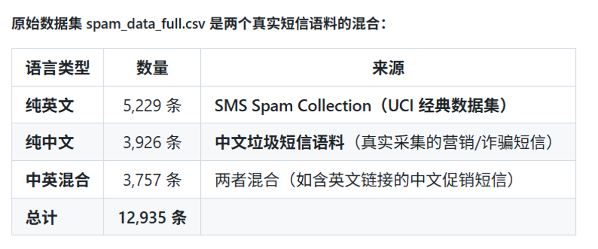
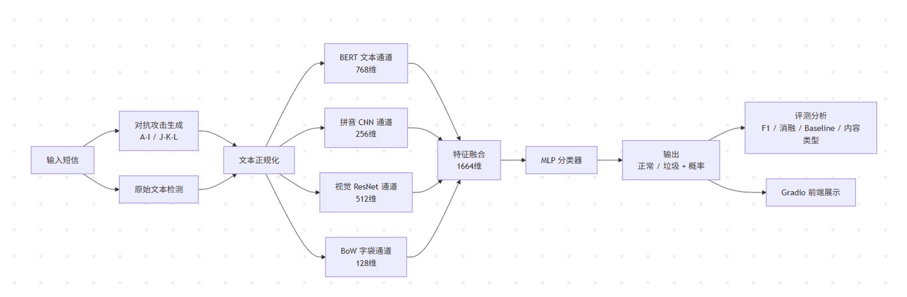

# 短信对抗攻防检测系统
## 最终实验报告

> 课程：大数据原理与技术
> 运行环境：Windows 11, Python 3.9。完整Python环境请见requirement.txt

---

## 小组成员贡献说明

| 学号 | 姓名 | 贡献内容 | 贡献权重(%) |
| :--- | :--- | :---: | :---: | 
| 23336129 | 梁仲禧 | 部分变体垃圾文本设计、代码调试与修复、实验设计与运行 | 30 |
| 23336339 | 钟俊喆 | 传统baseline复现、前端设计 | 20 |
| 23336106 | 李昌健 | 项目框架设计、四通道模型设计、部分变体垃圾文本设计 | 30 |
| 23336311 | 张相钊 | 实验报告撰写 | 10 |

---

## 摘要

本项目研究中文、英文及中英混合垃圾短信检测在文本变体下的鲁棒性。攻击侧实现了字符删除、字符插入、Unicode 同形字、零宽字符、同义词、音近字、形近字、繁简混用、乱序和拼音嵌入等 13 类文本变体；防御侧实现 BERT 文本模型、规则正规化 BERT、拼音 CNN、字形 ResNet18、BoW 统计特征及四通道门控融合模型，并以五种传统模型作为baseline。

实验采用固定随机种子进行分层划分，分别在纯净训练和 A/B 字符增强训练条件下对 Original 与 A-M 全部攻击类型进行测试。攻击生成遵循语言适用性约束，且只保留确实发生文本改变的样本；每个攻击集按原始测试集的类别比例构建混合二分类测试集。全类型结果表明，字符插入、同义词、Unicode 同形和拼音镶嵌等攻击在部分模型上会造成退化，而音近字、繁简混用和部分乱序攻击的影响较小甚至使 F1 上升。A/B 增强对不同攻击具有不均衡的迁移效果，因此鲁棒性必须按攻击类型和训练条件分别分析。

**关键词：** 垃圾短信检测；对抗文本变体；BERT；多通道融合；Word2Vec；拼音混淆；鲁棒性

---

## 1. 研究任务与问题定义

### 1.1 研究任务

传统垃圾短信检测通常依赖关键词、字符统计、词向量或上下文语义。攻击者可在基本保持可读性和原始标签的前提下删除、插入或替换部分字符，使字符串编码、分词边界和特征分布发生变化。例如，本文“免费领取优惠券”可以被改为“免f领q优h券”：人仍可凭保留汉字和拼音首字母还原语义，但模型可能失去部分词面特征。

项目任务包括：

1. 构建适用于多语言混合短信的文本变体生成器；
2. 实现传统模型、BERT 模型及四通道融合防御模型；
3. 在统一的二分类攻击测试集上评测不同变体；
4. 比较纯净训练和攻击增强训练，分析未见变体的泛化能力；
5. 提供可复现的数据、模型、评测脚本与交互演示。

### 1.2 变体垃圾文本
传统的垃圾文本检测模型在序列化处理、特征提取和固定模式匹配等方面存在局限性，如依赖字符统计特征、对编码和格式处理脆弱等。变体垃圾文本是攻击者利用人类的想象力、视觉容错、语义上下文补全等能力，构建出人类可读、但检测模型不可正确识别出垃圾语义的文本。  
严格遵循“人类可读，机器不可读”的思想，小组成员通过对生活经验的观察和总结，提出了一系列垃圾文本变体。

### 1.3 数学定义

给定短信文本 $x$ 和标签 $y \in \{0,1\}$，其中 $0$ 为正常短信，$1$ 为垃圾短信，分类器学习函数：

$$
\hat{y}=f(x), \qquad \hat{y}\in\{0,1\}
$$

对垃圾短信施加保持标签语义的第 $k$ 类变换 $T_k$：

$$
x^{(k)}=T_k(x), \qquad y^{(k)}=y=1
$$

采用同一模型在原始集与攻击集上的指标差评价影响：

$$
\Delta M_k=M_k-M_{\mathrm{Original}}
$$

其中 $M$ 为 Accuracy、Precision、Recall 或 F1。$\Delta M_k<0$ 表示该攻击使相应指标下降。

---

## 2. 数据集与实验方案

### 2.1 数据划分

原始数据文件为 `data/raw/spam_data_full.csv`，共 12,935 条，其中正常短信 7,741 条、垃圾短信 5,194 条。


采用随机种子 42 将数据集分层划分为训练集和测试集。
| 数据部分 | 总数 | 正常 | 垃圾 |
|---|---:|---:|---:|
| 原始训练集 | 9,054 | 5,418 | 3,636 |
| 原始测试集 | 3,881 | 2,323 | 1,558 |
| 纯净训练文件 `train_clean.csv` | 9,054 | 5,418 | 3,636 |
| A/B 增强训练文件 `train.csv` | 10,144 | 5,418 | 4,726 |

增强训练文件在原始训练部分额外加入 A、B 两类攻击垃圾各 545 条。纯净和增强设置保持完全相同的原始训练/测试划分，以分离训练增强带来的影响。

### 2.2 攻击集构建原则

数据集包含中文、英文和中英混合短信，因此攻击生成先检查文本是否具备相应的语言或字符条件：

- A、F、G、H、M 只处理含汉字文本；
- C 只处理含可替换拉丁字母的文本；
- E 只处理命中同义词映射的文本；
- B、D、I、J 为语言无关的字符扰动；
- K、L 依赖音近字变化，只处理含汉字文本。

每条攻击垃圾均要求 `text != original_text`。对每种攻击，按原始测试集的正常/垃圾比例抽取正常短信，因此测试文件的垃圾占比约为 40.14%，可公平比较 Accuracy、Precision、Recall 和 F1。所有攻击垃圾保留 `original_text`，可用于后续成对攻击成功率分析。

### 2.3 攻击集规模

| 攻击 | 有效攻击垃圾 | 混合测试集总数 |
|---|---:|---:|
| A 字符删除 | 1,349 | 3,360 |
| B 字符插入 | 1,558 | 3,881 |
| C Unicode 同形字 | 833 | 2,075 |
| D 零宽字符 | 1,558 | 3,881 |
| E 同义词替换 | 303 | 755 |
| F 中文音近字 | 1,344 | 3,348 |
| G 中文形近字 | 1,043 | 2,598 |
| H 繁简混用 | 1,329 | 3,311 |
| I 字符乱序 | 1,556 | 3,876 |
| J 强乱序 | 1,557 | 3,879 |
| K 强音近字 | 1,344 | 3,348 |
| L 混合攻击 | 1,348 | 3,358 |
| M 拼音首字母镶嵌 | 1,348 | 3,358 |

`test_full.csv` 收录原始测试样本和全部攻击垃圾，共 16,102 条。逐攻击结论只使用对应的 `adv_*.csv`，不以类别分布不同的汇总池替代单攻击评测。

---

## 3. 算法设计

### 3.1 对抗变体设计

| 编号 | 类型 | 核心操作 | 目标 |
|---|---|---|---|
| A | 字符删除 | 随机删除部分中文字符 | 破坏关键词和字符顺序 |
| B | 字符插入 | 插入特殊符号 | 扰动 token 化与词边界 |
| C | Unicode 同形字 | 替换视觉相近的拉丁字符 | 改变 Unicode 编码 |
| D | 零宽字符 | 插入零宽空格、连接符或 BOM | 改变字符串边界 |
| E | 同义词替换 | 替换“免费、领取、贷款”等词 | 改变词面信息 |
| F | 中文音近字 | 使用同音或近音字替换 | 保留读音，破坏字面关键词 |
| G | 中文形近字 | 使用视觉相近汉字或兼容字符替换 | 保留部分字形相似性 |
| H | 繁简混用 | 将部分简体字转换为繁体字 | 改变字符编码与字形 |
| I/J | 局部乱序/强乱序 | 邻近或窗口级字符重排 | 破坏局部顺序 |
| K | 强音近字 | 提高音近字替换比例 | 增强读音层面的干扰 |
| L | 混合攻击 | 强音近字后强乱序 | 组合多种扰动 |  
| M | 拼音镶嵌 | 交替保留汉字和替换汉字为拼音首字母 | 破坏自然语言特征分布 |

### 3.2 四通道融合防御模型
本项目提出了一个融合了文本、拼音、视觉、字符统计的四通道防御模型。  
四个互补特征通道如下：

- **文本通道：** `bert-base-chinese` 编码上下文语义；
- **拼音通道：** 文本转拼音序列后使用 CNN 提取局部音节模式；
- **视觉通道：** 字符渲染为图像，使用 ResNet18 提取字形特征；
- **BoW 通道：** 字符统计与词袋特征，捕获高频垃圾模式。

设四通道输出为 $h_t,h_p,h_v,h_b$，先投影到统一空间：

$$
z_i=P_i(h_i), \quad i\in\{t,p,v,b\}
$$

再利用门控网络融合：

$$
g=\operatorname{softmax}(W_g[z_t;z_p;z_v;z_b]+b_g), \qquad h=\sum_i g_i z_i
$$

最后由分类头输出垃圾概率。该设计试图在某一表示受扰动时利用其他表示提供补充，例如音近字攻击可由拼音通道保留读音信息，形近字和繁简字可由视觉通道补充。  

### 3.3 传统baseline

为衡量算法收益，实现五个传统baseline：GAS-lite、Word2Vec-w+LR、Word2Vec-c+LR、Word2Vec-c+GBDT 和 Doc2Vec-c+GBDT。GAS-lite 使用字符共现图和风险传播特征；两类 Word2Vec 分别以词和字符为 token，经 IDF 加权池化后输入 LR 或 GBDT；Doc2Vec-c+GBDT 将字符序列编码为文档向量后分类。它们与 BERT、四通道模型形成从浅层统计到深层语义的对照。

### 3.4 短信对抗攻防检测系统架构
将四通道模型与各个对抗文本生成脚本接入前端，构成我们最终的短信对抗攻防检测系统。用户输入文本后，可选择对应的变体类型来生成对抗文本，并使用我们的模型检测其是否为垃圾短信。  
整个系统的架构图如下：


---

## 4. 实现与评测方法

### 4.1 评测流程

对每一个攻击文件，系统重新执行对应模型的特征构造、预测及指标计算，避免将原始文本的特征错误复用于攻击文本。报告统一使用：

$$
Accuracy=\frac{TP+TN}{TP+TN+FP+FN}
$$

$$
Precision=\frac{TP}{TP+FP}, \qquad Recall=\frac{TP}{TP+FN}, \qquad
F1=\frac{2\cdot Precision\cdot Recall}{Precision+Recall}
$$

其中 F1 是本报告比较变体影响的主指标；`ALL` 汇总集仅用于整体观察，不参与逐攻击横向排名。

### 4.2 代码组织与说明

| 路径 | 职责 |
|---|---|
| `experiments/generate_adv.py` | 分层划分、训练增强、A-M 攻击数据生成 |
| `attack/` | 各类攻击实现、适用性判断和 M 型攻击 |
| `classic_baselines.py` | 五种传统baseline训练与逐攻击评测 |
| `train_baseline_direct.py` | BERT 及正规化 BERT 训练 |
| `train_fourchannels_direct.py` | 四通道融合模型训练 |
| `defense/` | 文本、拼音、视觉、BoW 通道及融合网络 |
| `evaluate_direct.py` | 加载已有深度模型进行评测与消融 |
| `run_strong_attack.py` | J/K/L 强攻击生成与评测 |
| `app.py` | Gradio 交互式演示 |

攻击注册函数集中在 `attack/__init__.py`：`is_attack_applicable` 负责语言和特征条件筛选，`apply_attack` 统一调度攻击函数。生成脚本再过滤未发生实际改变的记录。该分层使攻击策略、数据构造和模型评测相互独立，便于复现实验和扩展攻击类型。

---

## 5. 实验结果

### 5.1 结果说明

本节将每一种攻击与其他攻击同等纳入比较。纯净训练使用 `train_clean.csv`，增强训练使用在相同原始训练集上加入 A/B 各 545 条样本的 `train.csv`；两种设置均在 Original 和 A-M 全部测试集上评测。深度模型结果来自 `results/eval_results_clean.csv` 和 `results/eval_results.csv`，传统模型结果来自 `results/classic_baseline_results_clean_filtered.csv` 和 `results/classic_baseline_results_filtered.csv`。表中数值均为 F1。

### 5.2 纯净训练下的 A-M 全攻击结果

| 测试集 | 朴素 BERT | BERT+正规化 | 四通道融合 | GAS-lite | Word2Vec-w+LR | Word2Vec-c+LR | Word2Vec-c+GBDT | Doc2Vec-c+GBDT |
|---|---:|---:|---:|---:|---:|---:|---:|---:|
| Original | 0.9576 | 0.9594 | 0.9584 | 0.8104 | 0.9014 | 0.8585 | 0.8950 | 0.7438 |
| A 字符删除 | 0.9615 | 0.9621 | 0.9610 | 0.8462 | 0.9067 | 0.8909 | 0.9011 | 0.7749 |
| B 字符插入 | 0.9494 | 0.9564 | 0.9399 | 0.8441 | 0.8791 | 0.8446 | 0.8967 | 0.8095 |
| C Unicode 同形 | 0.9524 | 0.9512 | 0.9579 | 0.7894 | 0.7925 | 0.8503 | 0.8968 | 0.6914 |
| D 零宽字符 | 0.9576 | 0.9594 | 0.9584 | 0.8104 | 0.8460 | 0.8585 | 0.8950 | 0.7418 |
| E 同义词替换 | 0.9423 | 0.9501 | 0.9522 | 0.8338 | 0.9048 | 0.8917 | 0.9073 | 0.7806 |
| F 中文音近字 | 0.9724 | 0.9676 | 0.9724 | 0.8637 | 0.9095 | 0.9046 | 0.9223 | 0.7755 |
| G 中文形近字 | 0.9577 | 0.9623 | 0.9586 | 0.8568 | 0.9096 | 0.8986 | 0.9080 | 0.7657 |
| H 繁简混用 | 0.9679 | 0.9638 | 0.9620 | 0.8695 | 0.9064 | 0.8951 | 0.9064 | 0.7544 |
| I 字符乱序 | 0.9588 | 0.9600 | 0.9533 | 0.8107 | 0.8604 | 0.8587 | 0.8956 | 0.7667 |
| J 强乱序 | 0.9592 | 0.9590 | 0.9533 | 0.8106 | 0.8317 | 0.8588 | 0.8953 | 0.7687 |
| K 强音近 | 0.9750 | 0.9713 | 0.9772 | 0.8700 | 0.9073 | 0.9106 | 0.9314 | 0.7714 |
| L 混合攻击 | 0.9762 | 0.9721 | 0.9769 | 0.8666 | 0.8650 | 0.9124 | 0.9285 | 0.7746 |
| M 拼音首字母镶嵌 | 0.9506 | 0.9552 | 0.9321 | 0.8780 | 0.6725 | 0.8841 | 0.9267 | 0.7339 |

纯净训练下，攻击效果并不一致。对深度模型而言，B 字符插入和 E 同义词替换在多个模型上造成较明显下降；D 零宽字符与 Original 数值相同，说明当前模型对该形式的处理基本不敏感。对传统模型而言，M 对 Word2Vec-w+LR 的下降最大，为 0.2290；C 对 GAS-lite、Word2Vec-w+LR 和 Doc2Vec-c+GBDT 也有明显影响。  
无论在测试集下，朴素BERT、BERT+正规化、四通道融合等模型的 F1 分数都远高于其他传统模型。

### 5.3 A/B 增强训练下的 A-M 全攻击结果

| 测试集 | 朴素 BERT | BERT+正规化 | 四通道融合 | GAS-lite | Word2Vec-w+LR | Word2Vec-c+LR | Word2Vec-c+GBDT | Doc2Vec-c+GBDT |
|---|---:|---:|---:|---:|---:|---:|---:|---:|
| Original | 0.9618 | 0.9534 | 0.9626 | 0.8380 | 0.8978 | 0.8541 | 0.8945 | 0.7452 |
| A 字符删除 | 0.9691 | 0.9627 | 0.9696 | 0.8808 | 0.9130 | 0.8983 | 0.9035 | 0.7817 |
| B 字符插入 | 0.9755 | 0.9777 | 0.9786 | 0.8839 | 0.9323 | 0.9293 | 0.9290 | 0.8169 |
| C Unicode 同形 | 0.9479 | 0.9524 | 0.9575 | 0.8048 | 0.9030 | 0.8240 | 0.8884 | 0.7227 |
| D 零宽字符 | 0.9618 | 0.9534 | 0.9626 | 0.8380 | 0.9137 | 0.8541 | 0.8945 | 0.7387 |
| E 同义词替换 | 0.9499 | 0.9445 | 0.9547 | 0.8636 | 0.9071 | 0.8746 | 0.8931 | 0.7608 |
| F 中文音近字 | 0.9723 | 0.9729 | 0.9759 | 0.8900 | 0.9104 | 0.9053 | 0.9164 | 0.7760 |
| G 中文形近字 | 0.9655 | 0.9568 | 0.9677 | 0.8877 | 0.9073 | 0.9003 | 0.9116 | 0.7676 |
| H 繁简混用 | 0.9686 | 0.9573 | 0.9668 | 0.8937 | 0.9018 | 0.9060 | 0.9075 | 0.7589 |
| I 字符乱序 | 0.9664 | 0.9685 | 0.9685 | 0.8385 | 0.9089 | 0.8539 | 0.8951 | 0.7726 |
| J 强乱序 | 0.9654 | 0.9675 | 0.9675 | 0.8383 | 0.9086 | 0.8540 | 0.8948 | 0.7723 |
| K 强音近 | 0.9760 | 0.9760 | 0.9781 | 0.8958 | 0.9123 | 0.9150 | 0.9267 | 0.7571 |
| L 混合攻击 | 0.9764 | 0.9828 | 0.9789 | 0.8961 | 0.9179 | 0.9149 | 0.9307 | 0.7564 |
| M 拼音首字母镶嵌 | 0.9746 | 0.9787 | 0.9771 | 0.9002 | 0.9344 | 0.8918 | 0.9231 | 0.6655 |

A/B 增强后，B、I、J、M 等多种字符扰动在多数模型上的 F1 上升，说明字符级增强具有一定跨攻击迁移能力；但Doc2Vec-c+GBDT 在 K、L、M 上的 F1 不仅没有获得改善，反而有所下降。  
无论哪种测试集，深度模型的 F1 分数依然远高于传统模型。

### 5.4 四通道模型攻击前后变化与融合消融

以同一训练设置下的 Original 为基准，所有攻击的 F1 变化均按 $\Delta F1=F1_{attack}-F1_{Original}$ 计算。为避免只挑选某一种攻击进行解释，四通道融合模型在 A-M 上的变化完整列如下：

| 攻击 | A | B | C | D | E | F | G | H | I | J | K | L | M |
|---|---:|---:|---:|---:|---:|---:|---:|---:|---:|---:|---:|---:|---:|
| 纯净训练 | +0.0026 | -0.0185 | -0.0005 | 0.0000 | -0.0062 | +0.0140 | +0.0002 | +0.0036 | -0.0051 | -0.0051 | +0.0188 | +0.0185 | -0.0263 |
| A/B 增强训练 | +0.0070 | +0.0160 | -0.0051 | 0.0000 | -0.0079 | +0.0133 | +0.0051 | +0.0042 | +0.0059 | +0.0049 | +0.0155 | +0.0163 | +0.0145 |

纯净训练下，B 字符插入是除 M 外下降最明显的攻击，E 同义词替换、I 字符乱序和 J 强乱序也造成下降；A、F、G、H、K、L 的 F1 则不低于原始测试集，其中 K 和 L 的升幅最大。A/B 增强训练后，B、I、J 和 M 的下降被消除并转为上升，A、F、G、H、K、L 仍保持正向变化；C 和 E 仍分别下降 0.0051 和 0.0079。这说明增强样本对字符串扰动具有部分迁移效果，但不能覆盖 Unicode 同形和语义替换等机制。M 只是其中一种受影响较明显且被增强改善的攻击，不能作为全部鲁棒性结论的代表。

融合消融采用“逐个通道置零、其余参数不变”的方法，在 Original 和每个 A-M 测试集上重新计算 F1。结果摘要如下，括号内为相对于完整四通道模型的 F1 变化范围：

| 训练设置 | 被置零通道 | Original F1 | A-M 上相对完整模型的 F1 变化范围 | 结果解释 |
|---|---|---:|---:|---|
| 纯净训练 | text | 0.5729 | -0.4043 至 -0.3592 | 去除文本表示后模型接近多数类baseline，当前模型的判别能力主要由文本通道承担 |
| 纯净训练 | phonetic | 0.9587 | 0.0000 至 +0.0017 | 去除拼音通道没有造成下降，当前训练中未观察到稳定的独立增益 |
| 纯净训练 | visual | 0.9584 | 0.0000 至 0.0000 | 在当前参数和评测集上，去除视觉通道未改变 F1 |
| 纯净训练 | bow | 0.9584 | 0.0000 至 0.0000 | 在当前参数和评测集上，去除 BoW 通道未改变 F1 |
| A/B 增强训练 | text | 0.5732 | -0.4056 至 -0.3819 | 去除文本表示后同样接近多数类baseline，结论不依赖于是否进行 A/B 增强 |
| A/B 增强训练 | phonetic | 0.9625 | -0.0004 至 +0.0032 | 影响很小，E 同义词测试集上的变化最大，但不足以说明普遍增益 |
| A/B 增强训练 | visual | 0.9626 | 0.0000 至 0.0000 | 在当前参数和评测集上未观察到可测的 F1 变化 |
| A/B 增强训练 | bow | 0.9626 | 0.0000 至 0.0000 | 在当前参数和评测集上未观察到可测的 F1 变化 |

因此，消融实验能够支持的结论是：当前融合模型的最终判别结果高度依赖文本通道，拼音通道的边际影响较小，视觉和 BoW 通道在本次零点置零实验中几乎没有体现出独立贡献。这里的“没有体现”不等于这些通道在理论上无用，因为消融没有重新训练模型，也没有测量单通道模型性能；它只反映了现有训练参数、门控权重和测试分布下的即时依赖关系。若要证明四个通道具有互补性，应进一步采用重新训练的单通道/逐通道模型。

---

## 6. 结果分析

### 6.1 不同攻击类型的影响

全类型结果呈现出三类现象。第一，字符插入、同义词替换和 Unicode 同形字会在部分模型上造成下降，原因是它们直接改变 token、词面或编码表示；其中纯净训练的四通道模型在 B、E、I、J、M 上下降。第二，零宽字符在当前深度模型上几乎不改变 F1，说明模型输入处理可能已经弱化了这类字符的影响。第三，音近字、繁简混用以及部分强攻击没有普遍造成下降，可能是短信中的数字、链接、促销句式和剩余字符仍然提供了有效垃圾线索。

Word2Vec-w+LR 在 F、G、H、M 上的性能差异显著体现了攻击影响的非一致性：纯净训练下，M 使模型的 F1 从 0.9014 降至 0.6725，产生明显退化；而 F、G、H 反而使 F1 上升。这说明攻击是否有效取决于变体机制与模型特征之间的匹配关系。

### 6.2 训练增强的跨攻击迁移

比较两组 A-M 表格可以看到，A/B 增强并非对所有攻击产生相同收益。对四通道模型，B、I、J、M 的 F1 分别提升 0.0386、0.0152、0.0142、0.0450，A、F、G、H、K、L 也有提升；但 C、E 分别变化 -0.0004、+0.0025，且不同模型的方向并不完全一致。对 BERT+正规化模型，A/B 增强使 B、L、M 等攻击的 F1 提升，同时 Original、D、E、G、H 的原始性能下降。因此，增强样本提供的是对字符串扰动分布的部分迁移，而不是对所有攻击机制的统一防御。

### 6.3 多通道模型的能力与限制
四通道模型在纯净训练下对 A-M 的 F1 变化范围为 -0.0263 至 +0.0188，在增强训练下变化范围为 -0.0079 至 +0.0163。将四通道融合与朴素 BERT 逐个测试集比较，可以观察到训练条件对融合效果有明显影响。

在纯净训练下，Original 上四通道融合的 F1 为 0.9584，略高于朴素 BERT 的 0.9576。在 A-M 攻击集上，四通道融合在 C、D、E、G、K、L 六类攻击上高于朴素 BERT，在 F 上基本持平，在 A、B、H、I、J、M 六类攻击上低于朴素 BERT。因此，不能简单地认为四通道模型在纯净训练下普遍优于或普遍劣于朴素 BERT；更合理的解释是，未经过变体增强的训练数据无法充分教会拼音、视觉和 BoW 通道如何处理攻击后的表示，门控网络也就难以稳定地利用这些通道形成互补。在这种情况下，增加通道可能带来有限收益，也可能引入与当前输入分布不匹配的特征，导致 B、I、J、M 等测试集上的性能低于更直接的文本模型。

A/B 增强训练后，Original 上四通道融合的 F1 为 0.9626，高于朴素 BERT 的 0.9618；在 A-M 攻击集上，四通道融合有 12 类高于朴素 BERT，仅 H 繁简混用低于朴素 BERT（0.9668 对 0.9686）。这说明少量 A/B 变体训练样本不仅提升了 A、B 等已接近训练分布的扰动表现，也使模型学习到了一部分可迁移的字符级变化模式，使不同通道在多数攻击测试集上能够提供更有效的互补信息。需要强调的是，这种改善是经验上的跨攻击迁移，并不意味着每个通道都学到了对应攻击的专门表示；C、E 等攻击的具体表现仍受其变换机制和通道输入处理方式影响。

消融结果进一步表明，当前融合模型的最终判别结果主要依赖文本通道，拼音通道的即时边际影响较小，视觉和 BoW 通道在本次置零实验中未表现出可测的 F1 贡献。这与上述性能差异并不矛盾：消融反映的是固定训练模型在去除某个通道后的即时依赖，而朴素 BERT 与融合模型的横向比较反映的是增加通道及其门控参数后整体训练结果的差异。当前结果支持的结论是，四通道结构具有在变体增强后形成互补的潜力，但这种潜力依赖训练数据是否覆盖足够的表示变化，不能仅凭结构设计本身保证。

---

## 7. 创新点与结论

### 7.1 创新点

1. **语言适用性约束的攻击生成。** 对中英混合短信按攻击机制筛选可处理文本，并剔除未改变样本，使攻击测试集反映实际变体而非函数调用次数。
2. **可读拼音首字母镶嵌攻击。** M 在保留部分汉字阅读锚点的同时扰动中文词面特征，能够有效检验文本模型在可读字符变体上的泛化。
3. **统一比例的逐攻击评测。** 每种攻击均采用原始类别比例构造二分类混合集，避免不同攻击文件的类别分布干扰指标比较。
4. **语义、读音、字形和统计信息的门控融合。** 四通道模型为不同文本变体提供了可扩展的互补表征框架，并通过消融说明各通道的实际贡献。
5. **纯净与增强训练对照。** 在相同原始划分下比较两种训练条件，明确展示数据增强对未知变体表现的影响。

### 7.2 结论

项目完成了从攻击生成、数据管理、传统与深度模型训练、逐攻击评测到交互演示的完整流程。当前实验表明：项目设计的文本变体确实能够降低部分传统模型和融合模型的性能;攻击效果不由攻击类型单独决定，而由攻击形式、文本语言、特征表示、分类器和训练分布共同决定。

---

## 附录：
### 代码说明：
由于本项目较大，这里提供Github仓库：
```cmd
HTTPS: https://github.com/meijn572/text-defence.git
SSH: git@github.com:meijn572/text-defence.git
```
Release 里面有模型参数可供下载

### 复现说明

安装依赖并生成数据：

```powershell
conda create -n BigData python=3.9
conda activate BigData
pip install -r requirements_new.txt
python experiments/generate_adv.py
```

运行传统baseline：

```powershell
python classic_baselines.py
```

训练和评测深度模型：

```powershell
python train_baseline_direct.py
python train_fourchannels_direct.py
python evaluate_direct.py
```

运行界面演示 Web UI：

```powershell
python app.py
```

关键结果文件包括 `results/classic_baseline_results_clean_filtered.csv`、`results/classic_baseline_results_filtered.csv`、`results/eval_results_clean.csv` 和 `results/eval_results.csv`。其中前两者分别对应传统模型在纯净/增强训练下的 A-M 结果，后两者对应深度模型在纯净/增强训练下的 A-M 结果。